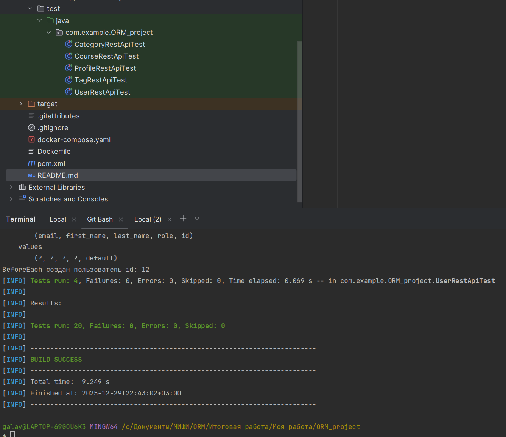

# ORM project

## Цель проект

Создать интерактивную учебную платформу, имитирующую реальный процесс обучения ORM в backend-разработке, где студенты не просто смотрят лекции, а работают с живой системой, построенной на Spring Boot + JPA/Hibernate, и сами становятся её разработчиками через практику.

## Что реализовано

- Созданы все 15 сущностей;
- Созданы 15 резопозиториев с основными CRUD операциями;
- Реализовано полноценное управление всеми сущностями через Rest API;
- Интеграционное тестирование покрывает 100% методов - 60 тестов (по 4 crud операции на каждую сущность);
- Для централизованной обработки ошибок интегрирован ControllerAdvice;
- Предзаполнение данными в БД осуществляется в H2 профиля test. Все DML в файле data.sql.
- Следование принципам SOLID, DRY
- Настроена контейнеризация с автоматическим запуском тестов при сборке.

## Архитектура
Бэкенд:

- Слоистая архитектура: Controller → Service → Repository
- Spring Data JPA с кастомными @Query, @Modifying, @EntityGraph
- Аннотации Hibernate: @OneToMany, @ManyToOne, @ManyToMany, @Embedded, @Convert, @Formula, @DynamicUpdate

База данных:
- Для профиля dev - Postgres 15
- Для профиля test - H2


## Стек технологий

Java 21
Spring Boot + Spring Web + Spring Data JPA
PostgreSQL 15
Hibernate (через Spring Data JPA)
JUnit 5, @SpringBootTest, @Transactional, @TestPropertySource, REST Assured / MockMvc
Maven (mvn test, профили dev, test)
Docker + Docker Compose

## Структура проекта
```
ORM_project
├── .idea
├── .mvn
├── src
│ ├── main
│ │ ├── java
│ │ │ └── com.example.ORM_project
│ │ │ ├── controller       # внутри 15 (API-endpoints) хендлеров для управления каждой сущностью
│ │ │ ├── database
│ │ │ │ └── entity         # состоит из 15 JPA сущностей, запрошенных в задании
│ │ │ | └── repository     # внутри 15 репозиториев для каждой сущности 
│ │ │ ├── dto              # для каждой из 15 сущности созданы request и responce DTO, итого 30 файлов
│ │ │ ├── enums
│ │ │ ├── exceptions #реализовано управление исключением с внедрением ControllerAdvice
│ │ │ ├── mapper           # для каждой сущности есть свой mapper
│ │ │ ├── service          # 15 сервисов (бизнес логика)
│ │ │ └── OrmProjectApplication.java
│ │ └── resources
│ │ ├── static
│ │ ├── templates
│ │ ├── application.yaml
│ │ ├── application-dev.yaml   # конфигурация для dev профиля
│ │ ├── application-test.yaml  # конфигурация для test профиля
│ │ └── data.sql               # применяется к профилю test, где БД H2
│ └── test
│ └── java
│ └── com.example.ORM_project # 15 файлов для интгерационного тестирование - покрыто 100% методов
```

### Запуск тестов из IDE
```
mvn test
```
### Результаты тестов:

<p align="left">
  
</p>


### Запуск приложения Dev профиля в контейнере Docker
```
docker-compose up app-dev
```
- Команде RUN mvn clean verify запускает тесты во время сборки образа app. Если тесты завалятся, контейнер не поднимется с БД не поднимется.
- Доступ к API по порту 8080.
- В качестве БД используется Postgres 15


### Запуск приложения Test профиля в контейнере Docker
```
docker-compose up app-test
```
- Команде RUN mvn clean verify запускает тесты во время сборки образа app. Если тесты завалятся, контейнер не поднимется с БД не поднимется.
- Доступ к API по порту 8181.
- В качестве БД используется H2.


## Реализованные API: 

### 1. Управление пользователями (`UserController`)

Базовый путь: `/api/user`

| Метод  | Эндпоинт             | Тело запроса       | Ответ (успех)                            | Описание                 |
|--------|----------------------|--------------------|------------------------------------------|--------------------------|
| `POST`   | `/api/user`          | `UserRequestDto`   | `201 Created` + `UserResponseDto`       | Создать нового пользователя |
| `GET`    | `/api/user`          | —                  | `200 OK` + `List<UserResponseDto>`      | Получить всех пользователей |
| `GET`    | `/api/user/{id}`     | —                  | `200 OK` + `UserResponseDto`            | Получить пользователя по ID |
| `PUT`    | `/api/user/{id}`     | `UserRequestDto`   | `200 OK` + `UserResponseDto`            | Обновить пользователя по ID |
| `DELETE` | `/api/user/{id}`     | —                  | `200 OK` + `"User X успешно удален"`    | Удалить пользователя по ID |

Пример для отправки запроса:
```json
{
  "firstName": "Анна",
  "lastName": "Смирнова",
  "email": "anna@example.com",
  "role": "STUDENT"
}
```

### 2. Управление профилями (`ProfileController`)

Базовый путь: `/api/profile`

| Метод  | Эндпоинт              | Тело запроса          | Ответ (успех)                             | Описание                |
|--------|-----------------------|-----------------------|-------------------------------------------|-------------------------|
| `POST`   | `/api/profile`        | `ProfileRequestDto`   | `201 Created` + `ProfileResponseDto`     | Создать новый профиль   |
| `GET`    | `/api/profile`        | —                     | `200 OK` + `List<ProfileResponseDto>`    | Получить все профили    |
| `GET`    | `/api/profile/{id}`   | —                     | `200 OK` + `ProfileResponseDto`          | Получить профиль по ID  |
| `PUT`    | `/api/profile/{id}`   | `ProfileRequestDto`   | `200 OK` + `ProfileResponseDto`          | Обновить профиль по ID  |
| `DELETE` | `/api/profile/{id}`   | —                     | `200 OK` + `"Profile X успешно удален"`  | Удалить профиль по ID   |

Пример для отправки запроса:
```json
{
  "user_id": 42,
  "bio": "Студент, учусь в МИФИ",
  "avatarUrl": "https://example.com/avatars/anna.jpg",
}
```

### 3. Управление категориями (`CategoryController`)

Базовый путь: `/api/category`

| Метод  | Эндпоинт               | Тело запроса           | Ответ (успех)                              | Описание                 |
|--------|------------------------|------------------------|--------------------------------------------|--------------------------|
| `POST`   | `/api/category`        | `CategoryRequestDto`   | `201 Created` + `CategoryResponseDto`     | Создать новую категорию  |
| `GET`    | `/api/category`        | —                      | `200 OK` + `List<CategoryResponseDto>`    | Получить все категории   |
| `GET`    | `/api/category/{id}`   | —                      | `200 OK` + `CategoryResponseDto`          | Получить категорию по ID |
| `PUT`    | `/api/category/{id}`   | `CategoryRequestDto`   | `200 OK` + `CategoryResponseDto`          | Обновить категорию по ID |
| `DELETE` | `/api/category/{id}`   | —                      | `200 OK` + `"Category X успешно удален"`  | Удалить категорию по ID  |

Пример для отправки запроса:
```json
{
  "name": "Программирование",
}
```

### 4. Управление тегами (`TagController`)

Базовый путь: `/api/tag`

| Метод  | Эндпоинт            | Тело запроса        | Ответ (успех)                         | Описание              |
|--------|---------------------|---------------------|---------------------------------------|-----------------------|
| `POST`   | `/api/tag`          | `TagRequestDto`     | `201 Created` + `TagResponseDto`     | Создать новый тег     |
| `GET`    | `/api/tag`          | —                   | `200 OK` + `List<TagResponseDto>`    | Получить все теги     |
| `GET`    | `/api/tag/{id}`     | —                   | `200 OK` + `TagResponseDto`          | Получить тег по ID    |
| `PUT`    | `/api/tag/{id}`     | `TagRequestDto`     | `200 OK` + `TagResponseDto`          | Обновить тег по ID    |
| `DELETE` | `/api/tag/{id}`     | —                   | `200 OK` + `"Tag X успешно удален"`   | Удалить тег по ID     |

Пример для отправки запроса:
```json
{
  "name": "IT",
}
```

### 5. Управление курсами (`CourseController`)

Базовый путь: `/api/course`

| Метод  | Эндпоинт               | Тело запроса         | Ответ (успех)                              | Описание               |
|--------|------------------------|----------------------|--------------------------------------------|------------------------|
| `POST`   | `/api/course`          | `CourseRequestDto`   | `201 Created` + `CourseResponseDto`       | Создать новый курс     |
| `GET`    | `/api/course`          | —                    | `200 OK` + `List<CourseResponseDto>`      | Получить все курсы     |
| `GET`    | `/api/course/{id}`     | —                    | `200 OK` + `CourseResponseDto`            | Получить курс по ID    |
| `PUT`    | `/api/course/{id}`     | `CourseRequestDto`   | `200 OK` + `CourseResponseDto`            | Обновить курс по ID    |
| `DELETE` | `/api/course/{id}`     | —                    | `200 OK` + `"Course X успешно удален"`    | Удалить курс по ID     |

Пример для отправки запроса:

```json
{
  "title": "Java для начинающих",
  "description": "Базовый курс по Java SE",
  "duration": "3 месяца",
  "start_date": "01.09.2025",
  "teacher_id": 123,
  "category_id": 45,
  "tag_ids": [1, 2, 5]
}
```

### 6. Управление модулями (`ModuleController`)

Базовый путь: `/api/module`

| Метод  | Эндпоинт             | Тело запроса         | Ответ (успех)                            | Описание               |
|--------|----------------------|----------------------|------------------------------------------|------------------------|
| `POST`   | `/api/module`        | `ModuleRequestDto`   | `201 Created` + `ModuleResponseDto`     | Создать новый модуль   |
| `GET`    | `/api/module`        | —                    | `200 OK` + `List<ModuleResponseDto>`    | Получить все модули    |
| `GET`    | `/api/module/{id}`   | —                    | `200 OK` + `ModuleResponseDto`          | Получить модуль по ID  |
| `PUT`    | `/api/module/{id}`   | `ModuleRequestDto`   | `200 OK` + `ModuleResponseDto`          | Обновить модуль по ID  |
| `DELETE` | `/api/module/{id}`   | —                    | `200 OK` + `"Module X успешно удален"`  | Удалить модуль по ID   |

Пример для отправки запроса:

```json
{
  "title": "Основы Spring Boot",
  "description": "Введение в Spring Boot, DI, REST",
  "course_id": 789
}
```

### 7. Управление уроками (`LessonController`)

Базовый путь: `/api/lesson`

| Метод  | Эндпоинт             | Тело запроса          | Ответ (успех)                            | Описание               |
|--------|----------------------|-----------------------|------------------------------------------|------------------------|
| `POST`   | `/api/lesson`        | `LessonRequestDto`    | `201 Created` + `LessonResponseDto`     | Создать новый урок     |
| `GET`    | `/api/lesson`        | —                     | `200 OK` + `List<LessonResponseDto>`    | Получить все уроки     |
| `GET`    | `/api/lesson/{id}`   | —                     | `200 OK` + `LessonResponseDto`          | Получить урок по ID    |
| `PUT`    | `/api/lesson/{id}`   | `LessonRequestDto`    | `200 OK` + `LessonResponseDto`          | Обновить урок по ID    |
| `DELETE` | `/api/lesson/{id}`   | —                     | `200 OK` + `"Lesson X успешно удален"`  | Удалить урок по ID     |

Пример для отправки запроса:

```json
{
  "title": "Введение в Spring Data JPA",
  "content": "Разбор аннотаций @Entity, @Repository, CrudRepository...",
  "module_id": 101
}
```

### 8. Управление поступлением на курсы (`EnrollmentController`)

Базовый путь: `/api/enrollment`

| Метод  | Эндпоинт                | Тело запроса              | Ответ (успех)                                | Описание                        |
|--------|-------------------------|---------------------------|----------------------------------------------|---------------------------------|
| `POST`   | `/api/enrollment`       | `EnrollmentRequestDto`    | `201 Created` + `EnrollmentResponseDto`     | Записать пользователя на курс   |
| `GET`    | `/api/enrollment`       | —                         | `200 OK` + `List<EnrollmentResponseDto>`    | Получить все записи             |
| `GET`    | `/api/enrollment/{id}`  | —                         | `200 OK` + `EnrollmentResponseDto`          | Получить запись по ID           |
| `PUT`    | `/api/enrollment/{id}`  | `EnrollmentRequestDto`    | `200 OK` + `EnrollmentResponseDto`          | Обновить запись по ID           |
| `DELETE` | `/api/enrollment/{id}`  | —                         | `200 OK` + `"Enrollment X успешно удален"`  | Отменить запись (удалить)       |

Пример для отправки запроса:

```json
{
  "student_id": 42,
  "course_id": 789,
  "enroll_date": "2025-12-30"
}
```

### 9. Управление заданиями (`AssignmentController`)

Базовый путь: `/api/assignment`

| Метод  | Эндпоинт                 | Тело запроса               | Ответ (успех)                                 | Описание                     |
|--------|--------------------------|----------------------------|-----------------------------------------------|------------------------------|
| `POST`   | `/api/assignment`        | `AssignmentRequestDto`     | `201 Created` + `AssignmentResponseDto`      | Создать новое задание        |
| `GET`    | `/api/assignment`        | —                          | `200 OK` + `List<AssignmentResponseDto>`     | Получить все задания         |
| `GET`    | `/api/assignment/{id}`   | —                          | `200 OK` + `AssignmentResponseDto`           | Получить задание по ID       |
| `PUT`    | `/api/assignment/{id}`   | `AssignmentRequestDto`     | `200 OK` + `AssignmentResponseDto`           | Обновить задание по ID       |
| `DELETE` | `/api/assignment/{id}`   | —                          | `200 OK` + `"Assignment X успешно удален"`   | Удалить задание по ID        |

Пример для отправки запроса:

```json
{
  "lesson_id": 55,
  "description": "Создать CourseController с CRUD-операциями",
}
```

### 10. Управление тестовыми заданиями (`TestCaseController`)

Базовый путь: `/api/test-case`

| Метод  | Эндпоинт                  | Тело запроса            | Ответ (успех)                                | Описание                          |
|--------|---------------------------|-------------------------|----------------------------------------------|-----------------------------------|
| `POST`   | `/api/test-case`          | `TestCaseRequestDto`    | `201 Created` + `TestCaseResponseDto`       | Создать новое тестовое задание    |
| `GET`    | `/api/test-case`          | —                       | `200 OK` + `List<TestCaseResponseDto>`      | Получить все тестовые задания     |
| `GET`    | `/api/test-case/{id}`     | —                       | `200 OK` + `TestCaseResponseDto`            | Получить тестовое задание по ID   |
| `PUT`    | `/api/test-case/{id}`     | `TestCaseRequestDto`    | `200 OK` + `TestCaseResponseDto`            | Обновить тестовое задание по ID   |
| `DELETE` | `/api/test-case/{id}`     | —                       | `200 OK` + `"TestCase X успешно удален"`    | Удалить тестовое задание по ID    |

Пример для отправки запроса:

```json
{
  "title": "Тест по Spring Boot",
  "module_id": 101,
}
```

### 11. Управление вопросами (`QuestionController`)

Базовый путь: `/api/question`

| Метод  | Эндпоинт               | Тело запроса            | Ответ (успех)                               | Описание                     |
|--------|------------------------|-------------------------|---------------------------------------------|------------------------------|
| `POST`   | `/api/question`        | `QuestionRequestDto`    | `201 Created` + `QuestionResponseDto`      | Создать новый вопрос         |
| `GET`    | `/api/question`        | —                       | `200 OK` + `List<QuestionResponseDto>`     | Получить все вопросы         |
| `GET`    | `/api/question/{id}`   | —                       | `200 OK` + `QuestionResponseDto`           | Получить вопрос по ID        |
| `PUT`    | `/api/question/{id}`   | `QuestionRequestDto`    | `200 OK` + `QuestionResponseDto`           | Обновить вопрос по ID        |
| `DELETE` | `/api/question/{id}`   | —                       | `200 OK` + `"Question X успешно удален"`   | Удалить вопрос по ID         |

Пример для отправки запроса:

```json
{
  "test_case_id": 1,
  "text": "TEST TEXT",
}
```

### 12. Варианты ответов (`AnswerOptionController`)

Базовый путь: `/api/answer-option`

| Метод  | Эндпоинт                    | Тело запроса                   | Ответ (успех)                                     | Описание                        |
|--------|-----------------------------|--------------------------------|---------------------------------------------------|---------------------------------|
| `POST`   | `/api/answer-option`        | `AnswerOptionRequestDto`       | `201 Created` + `AnswerOptionResponseDto`        | Создать вариант ответа          |
| `GET`    | `/api/answer-option`        | —                              | `200 OK` + `List<AnswerOptionResponseDto>`       | Получить все варианты ответов   |
| `GET`    | `/api/answer-option/{id}`   | —                              | `200 OK` + `AnswerOptionResponseDto`             | Получить вариант ответа по ID   |
| `PUT`    | `/api/answer-option/{id}`   | `AnswerOptionRequestDto`       | `200 OK` + `AnswerOptionResponseDto`             | Обновить вариант ответа по ID   |
| `DELETE` | `/api/answer-option/{id}`   | —                              | `200 OK` + `"AnswerOption X успешно удален"`     | Удалить вариант ответа по ID    |

Пример для отправки запроса:

```json
{
  "question_id": 101,
  "text": "@RestController",
}
```


### 13. Результаты прохождения тестов (`TestSubmissionController`)

Базовый путь: `/api/test-submission`

| Метод  | Эндпоинт                      | Тело запроса                   | Ответ (успех)                                      | Описание                                 |
|--------|-------------------------------|--------------------------------|----------------------------------------------------|------------------------------------------|
| `POST`   | `/api/test-submission`        | `TestSubmissionRequestDto`     | `201 Created` + `TestSubmissionResponseDto`       | Отправить результат прохождения теста    |
| `GET`    | `/api/test-submission`        | —                              | `200 OK` + `List<TestSubmissionResponseDto>`      | Получить все результаты                  |
| `GET`    | `/api/test-submission/{id}`   | —                              | `200 OK` + `TestSubmissionResponseDto`            | Получить результат по ID                 |
| `PUT`    | `/api/test-submission/{id}`   | `TestSubmissionRequestDto`     | `200 OK` + `TestSubmissionResponseDto`            | Обновить результат по ID (редко)         |
| `DELETE` | `/api/test-submission/{id}`   | —                              | `200 OK` + `"TestSubmission X успешно удален"`    | Удалить результат прохождения            |


Пример для отправки запроса:

```json
{
  "test_case_id": 42,
  "student_id": 8,
  "score": 50,
  "taken_at": "2025-12-30"
}
```

### 14. Управление решением заданий (`SubmissionController`)

Базовый путь: `/api/submission`

| Метод  | Эндпоинт               | Тело запроса              | Ответ (успех)                               | Описание                              |
|--------|------------------------|---------------------------|---------------------------------------------|---------------------------------------|
| `POST`   | `/api/submission`      | `SubmissionRequestDto`    | `201 Created` + `SubmissionResponseDto`    | Отправить решение задания (assignment) |
| `GET`    | `/api/submission`      | —                         | `200 OK` + `List<SubmissionResponseDto>`   | Получить все решения                  |
| `GET`    | `/api/submission/{id}` | —                         | `200 OK` + `SubmissionResponseDto`         | Получить решение по ID                |
| `PUT`    | `/api/submission/{id}` | `SubmissionRequestDto`    | `200 OK` + `SubmissionResponseDto`         | Обновить решение (например, досдать)   |
| `DELETE` | `/api/submission/{id}` | —                         | `200 OK` + `"Submission X успешно удален"` | Удалить решение                       |

Пример для отправки запроса:

```json
{
  "assignment_id": 27,
  "student_id": 42,
  "content": "public class Solution { public int add(int a, int b) { return a + b; } }",
  "submitted_at": "2025-12-30"
}
```

### 15. Отзывы (`ReviewController`)

Базовый путь: `/api/review`

| Метод  | Эндпоинт            | Тело запроса         | Ответ (успех)                          | Описание                     |
|--------|---------------------|----------------------|----------------------------------------|------------------------------|
| `POST`   | `/api/review`       | `ReviewRequestDto`   | `201 Created` + `ReviewResponseDto`   | Оставить отзыв/оценку        |
| `GET`    | `/api/review`       | —                    | `200 OK` + `List<ReviewResponseDto>`  | Получить все отзывы          |
| `GET`    | `/api/review/{id}`  | —                    | `200 OK` + `ReviewResponseDto`        | Получить отзыв по ID         |
| `PUT`    | `/api/review/{id}`  | `ReviewRequestDto`   | `200 OK` + `ReviewResponseDto`        | Обновить отзыв по ID         |
| `DELETE` | `/api/review/{id}`  | —                    | `200 OK` + `"Review X успешно удален"`| Удалить отзыв по ID          |

```json
{
  "course_id": 27,
  "student_id": 42,
  "raiting": 5,
  "created_at": "2025-12-30"
}
```

### Автор приложения: 
Галай Анатолий